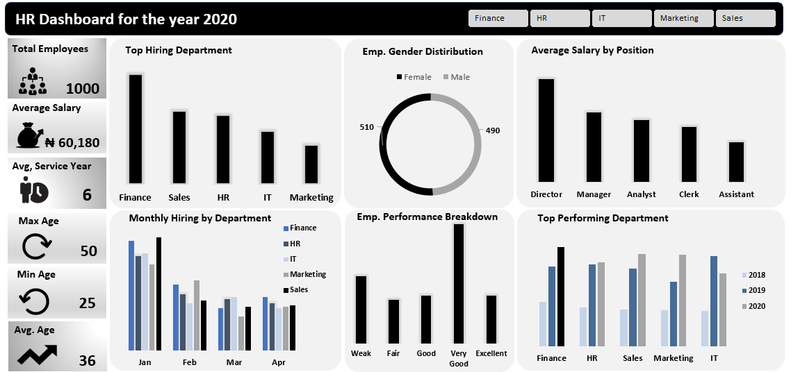

# HR-Analytics-Dashboard-Excel
# HR Analytics Dashboard Using Excel

## Project Overview
I built this HR Analytics Dashboard to provide comprehensive insights into workforce composition, salary, tenure, performance, and departmental distribution.  
Its primary objective is to support **data-driven decisions** regarding employee management, retention, and resource allocation.

---
## Data Cleaning and Preparation
The raw dataset contained missing, inconsistent, and non-standardized values. To ensure accurate analysis, the following steps were performed:

- Converted **Age** and **Salary** to numeric values  
- Standardized **Gender** and **Department** entries  
- Reformatted **Joining Date** to a consistent DD/MM/YYYY format  
- Added derived columns, including **Tenure**, **Performance Score**, and **Performance Category**  
- Built **Pivot Tables** to calculate key KPIs and support chart visualizations  
- Replaced missing entries with `"Unknown"` to maintain dataset completeness  
---
## Key Performance Indicators (KPIs)
- **Total Employees:** 1,000 employees across multiple departments  
- **Average Salary:** $60,180, reflecting a competitive pay structure  
- **Average Tenure:** 6 years, indicating strong retention  
- **Oldest Employee:** 50 years old, showcasing experienced talent  
- **Youngest Employee:** 25 years old, bringing fresh perspectives  
- **Average Age:** 36 years, suggesting a relatively young workforce  
- **Department Filtering:** KPIs can be filtered by department (HR, Finance, Sales, IT) using the dashboard slicer  

---
## Recommendations
- Targeted hiring in departments with fewer employees (e.g., IT) to balance workforce distribution  
- Conduct salary adjustments or benchmarking for departments earning below the average to maintain competitiveness  
- Implement training or mentorship programs for employees with lower performance scores to improve productivity  
- Leverage tenure data to develop retention strategies, particularly for newer employees  

---
